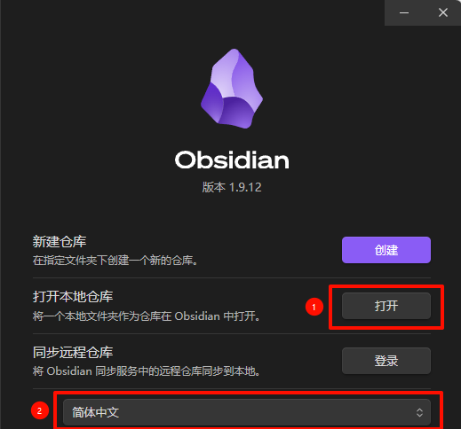
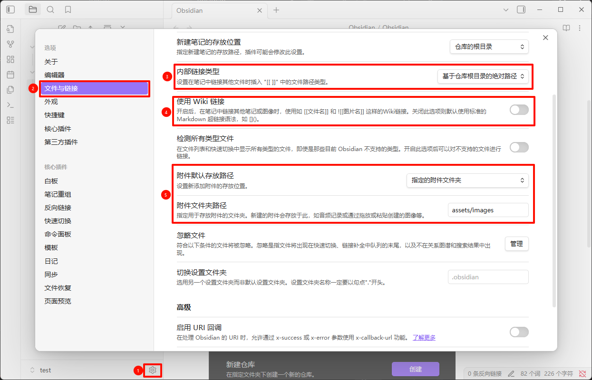
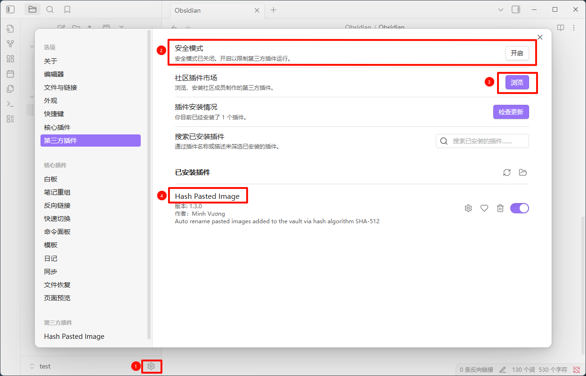
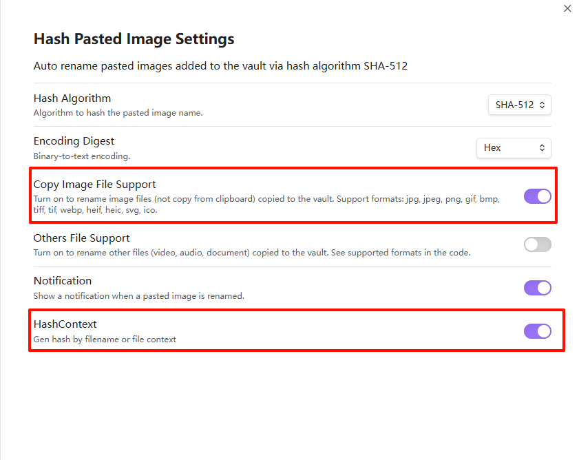

## 下载
从 [Obsidian官方网站](https://obsidian.md/) 下载Obsidian。
## 基础使用
Obsidian 将配置了`.obsidian`配置的文件夹作为仓库。
1. 可以通过`打开本地仓库`在指定的文件夹下创建一个仓库。
2. 通过`语言栏`切换软件使用的语言。
## 插入图片设置
通过如下设置，将图片放在指定文件夹。

关闭安全模式，安装第三方`Hash Paste Image`插件，设置图片自动重命名，相同的图片只存储一次。

