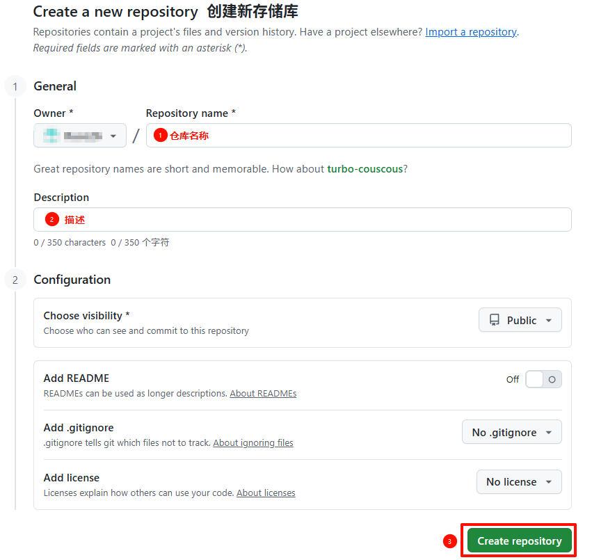
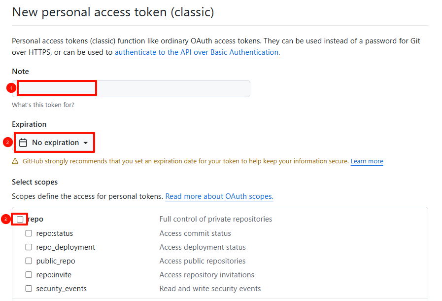
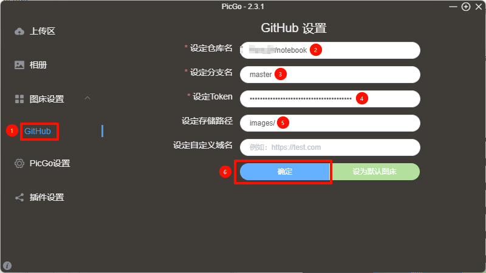
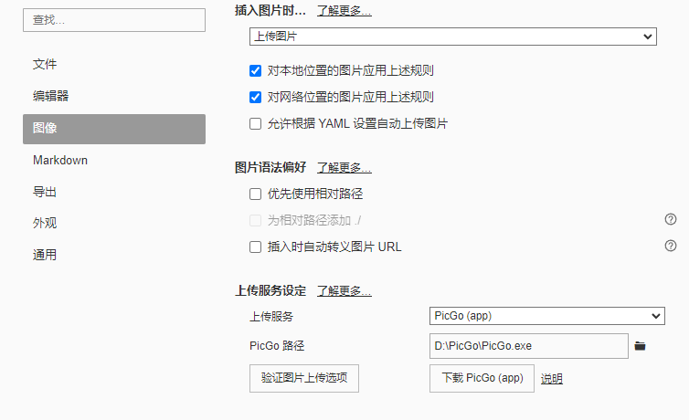

## 下载并安装
从[github 官网](https://github.com/Molunerfinn/PicGo) 下载 PicGo，并安装。
## 配置 github
创建 `github` 公开仓库。

获取 `github token`。点击右上角头像， `setting` -> `Developer settings` -> `Personal access tokens` -> `Generate new token` -> `勾选repo` -> `Generate token`。

## 配置PicGo

## 配置Typora

